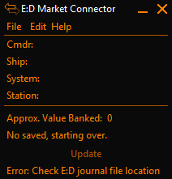
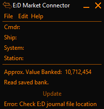
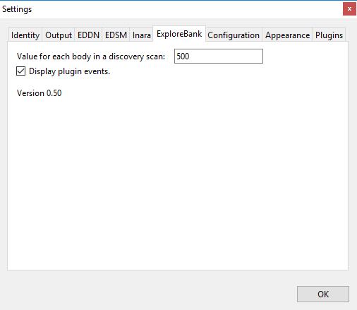

# Explore Bank
This is an EDMC plugin to show approximate profit from scanned celestial bodies. 

## Screenshots

## Functionality 
This plugin will keep track of discovery and surface scans to provide an estimate of the worth of the bank of exploration data gathered in Elite Dangerous. 
The values for surface scans are based upon the image provided from Cmdr Fru for ED 2.3 exploration. These values seem to be quite accurate as of now.

Approximate values come from discovery scans. There is currently no way, from the Journal, to determine more than the number of bodies picked up from the discovery scan.
By default, this plugin will assign a value of 500 credits per body found in a discovery scan. This value can be modified.

This plugin DOES/CAN NOT take into account first discoverer bonuses and powerplay bonuses. This tool is designed to give a number such that the CMDR using it can say "I should have at least this much banked."

## Installation

* On EDMC's Plugins settings tab press the “Open” button. This reveals the `plugins` folder where EDMC looks for plugins.
* Download the [latest release](https://github.com/TranslucentSabre/ExploreBank/releases/latest).
* Open the `.zip` archive that you downloaded and move the `ExploreBank` folder contained inside into the `plugins` folder.

You will need to re-start EDMC for it to notice the new plugin.

## Acknowledgements

Examples taken from Jonathan Harris' [HabZone](https://github.com/Marginal/HabZone).

## License

Copyright © 2018 Timothy Myers.

Licensed under the [MIT License](https://opensource.org/licenses/MIT).

